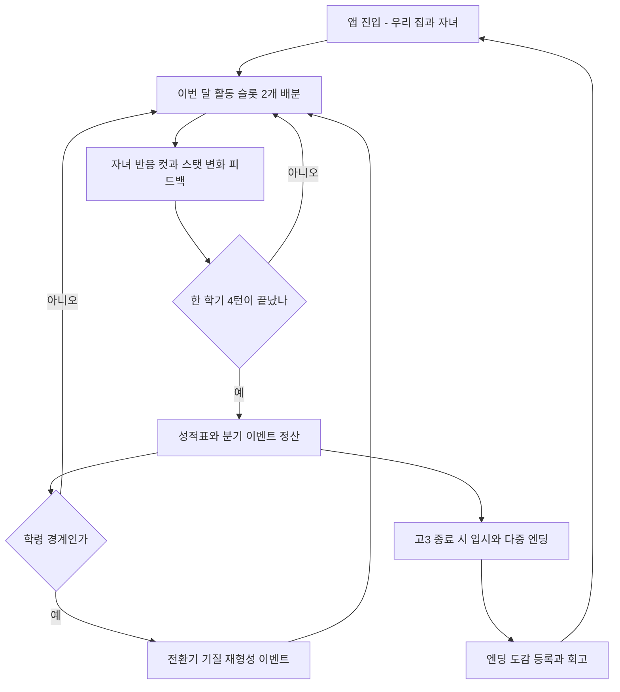

# 게임 디자인 문서

- 제품명: 내 새끼 대학 보내기 (app-id: keeum)
- 문서 상태: approved
- 버전/수정일: v1 / 2026-07-25
- Source of truth: 코어 루프·규칙·상태·진행·온보딩·저장 계약. 밸런스 수치의 라이브 원장은 Remote Config
- Open blockers: 없음 (수치는 플레이테스트 보정 대상으로 명시)
- 승인 근거: 사용자 최종 승인 "승인 + 승격 진행" / 2026-07-25

## 경험 타임라인

- 10초: 활동 카드 1개 선택 → 아이 즉시 반응(표정·대사·모션) + 스탯 델타 팝업. 입력→반응→인과→보상을 시각+소리+햅틱 복합 채널로.
- 3분: 한 학기(4턴) 슬롯 배분 → 성적표·정서/유대감/재력 정산·분기 이벤트가 1세션.
- 20~40분: 유아(약 6턴)→초등(약 12턴)→중등(약 12턴)→고등(약 15턴)→입시(약 3턴), 합계 약 48턴으로 한 아이 완주.
- 7일+: 엔딩·직업 도감 수집, 다음 아이 회차, 시즌 콘텐츠.

## 코어 루프

- 턴 = 1개월, 활동 슬롯 2개(슬롯 A 집중 축 = 학습, 슬롯 B 여가 축 = 정서·유대감·체력).
- 둘 다 학원이면 성적 급등·스트레스 폭증, 둘 다 놀이면 정서·유대감 상승·성적 정체 → 매 턴 균형 결정을 강제한다.
- 보상형 광고는 이번 달 보너스 슬롯 1개(유저 주도). 고등은 3슬롯 특강 옵션으로 스퍼트 감각. "지난 달 유지" 원탭 반복 제공.

## 규칙과 상태 머신

### 스탯

| 스탯 | 성격 | 상승 | 하강 |
| --- | --- | --- | --- |
| 성적(과목별) | 입시 핵심 | 학원·독서실·과외·특강 | 방치 시 정체 |
| 체력 | 활동 지속·번아웃 저항 | 자연놀이·운동·휴식 | 학원 과다 |
| 정서 | 힐링 축·엔딩 분기 | 가족시간·자연놀이·특기·휴식 | 압박 과다 |
| 특기 | 대안 엔딩 열쇠 | 예체능·체험·자연놀이 | 없음 |
| 유대감 | 전환기 성공 확률 동력·번아웃 완충. 느린 누적(벼락치기 불가) | 가족 여가·대화·아이 편들기·유혹 거절 | 압박·강요·방치·유혹 남용 |
| 가계 재력 | 부모 자원(화폐) | 아르바이트(고등)·이벤트·보상형 광고 | 학원·체험·소비 |
| 스트레스 | 숨은 게이지, 정서의 역 | 학원·압박 이벤트 | 휴식·자연놀이·가족시간 |

### 선천 4층 프로필 (회차마다 다른 아이)

| 층 | 축 | 역할 |
| --- | --- | --- |
| 기질 | 성실·산만·승부욕·감성·몰입·느긋 중 주 성향 | 활동 방법과의 궁합 |
| 인지 적성 | 암기·이해·언어·수리·창의 (등급 A~E) | 과목 성장 보정. 하드 벽 아님 |
| 체질 | 기초체력·건강·집중지속 | 활동 부하·부작용 저항 |
| 멘탈 | 스트레스내성·회복탄력성 | 번아웃 임계·정서 회복 |

- 적성→과목 매핑: 국어=언어+이해, 영어=언어+암기, 수학=수리+이해, 과학=이해+수리, 탐구=암기+이해, 특기=창의+신체감각.
- 적성은 처음 가려져 있고 활동으로 드러난다(디스커버리). 약점은 실패가 아니라 "이 아이만의 결"로 프레이밍한다.

### 성장 공식 (밸런스 v0 — deterministic test 대상, Remote Config 튜닝)

`Δ과목 = B_기관 × K_방법 × M_적성 × M_궁합 × M_컨디션`

- M_적성(관련 두 적성 등급 평균): A ×1.4 / B ×1.2 / C ×1.0 / D ×0.8 / E ×0.6.
- B_기관: 단과 전문학원 13, 개인과외 11, 종합입시학원 7/과목, 인강 6, 자습·독서실 5, 방과후 4.
- K_방법·S_스트레스원: 스파르타 1.40/+18, 선행 1.30/+12, 양치기 1.20/+9, 심화 1.15/+8, 개념이해 1.00/+5, 자기주도 0.90/+4, 체험·게임화 0.45/−4.
- M_컨디션(스트레스): 0~39 ×1.0, 40~59 ×0.9, 60~74 ×0.75, 75~89 ×0.55, 90 이상 ×0.35 + 번아웃 이벤트. 정서 70 이상이고 체력 60 이상이면 +0.1.
- 스트레스 변화: `ΔStress = S_방법 × T_기질 × (1 − 멘탈내성/200)` − 여가·휴식 회복.

M_궁합(기질×방법)과 T_기질:

| 기질 | 선행 | 심화 | 자기주도 | 양치기 | 개념 | 그룹 | 스파르타 | 체험 | T |
| --- | --- | --- | --- | --- | --- | --- | --- | --- | --- |
| 성실형 | 1.1 | 1.2 | 1.3 | 1.2 | 1.0 | 1.0 | 1.1 | 0.9 | 0.9 |
| 산만형 | 0.7 | 0.8 | 0.8 | 0.9 | 1.0 | 1.0 | 0.6 | 1.3 | 1.3 |
| 승부욕형 | 1.2 | 1.2 | 0.9 | 1.1 | 0.9 | 1.3 | 1.3 | 0.8 | 1.0 |
| 감성형 | 0.8 | 1.0 | 1.1 | 0.8 | 1.3 | 1.1 | 0.6 | 1.3 | 1.3 |
| 몰입형 | 1.1 | 1.3 | 1.3 | 0.8 | 1.4 | 0.9 | 0.9 | 1.2 | 1.0 |
| 느긋형 | 0.9 | 1.0 | 1.0 | 1.0 | 1.1 | 1.1 | 0.9 | 1.1 | 0.7 |

### 유혹 시스템 (성인 풍자 도덕 장치)

- 유혹은 이벤트 카드로 등장 → 수락/거절. 수락 시 즉시 이득 + 숨은 리스크 게이지 상승. 임계 초과 시 부작용·적발 이벤트(성적 급락·건강 악화·평판 붕괴). 거절 시 정직 보너스(정서·신뢰 상승).
- 반복 사용은 의존·내성으로 효율이 줄어 남용을 스스로 억제한다. 유혹 이력은 엔딩에 반영된다.
- 로스터: 집중력 각성제(대표), 시험지 유출, 스펙 조작, 고액 컨설팅 한탕, 대리시험 브로커. 전부 가상명.
- 표현 수위(등급 전략 A안): 투약 행위·효과의 구체 연출 없이 선택·결과 중심 간접 표현. 실존 약품명 없음, 미화 없음, 부작용·적발 명확. 약 없이도 균형만으로 명문대 도달 가능해야 한다.

### 전환기 기질 재형성 (유대감 기반)

| 게이트 | 나이 | 재편 |
| --- | --- | --- |
| 유아→초등 | 7~8 | 기초 기질 형성 |
| 초등→중등 | 13~14 | 대전환 — 성향 재편 + 잠재 적성 개화 |
| 중등→고등 | 16~17 | 진로 정체성 고착 |

- 전환기에 "진지한 가족 논의" 이벤트가 열리고, 성공 확률 = f(유대감) + 정합 보정 + 정서 보정. 급격한 변화일수록 저항 증가.
- 보상형 광고 "진심이 닿는 시간"으로 1회 확률 부스트(+20%p). 광고 없이 유대감만으로 고확률 가능. 유료 가챠로 성향을 바꾸지 않는다.
- 실패해도 하드 실패 없음: 성향 유지 또는 소폭 변화 + 재시도 여지.

## 진행

- 연령 단계: 유아(4~7) → 초등(8~13) → 중등(14~16) → 고등(17~19) → 입시(19). 단계별로 활동 로스터가 해금된다(아르바이트는 고등).
- 학기 = 4턴, 학년 = 2학기. 학기말 성적표·분기 이벤트, 진급 시 성장 시각 연출.
- 엔딩: 2층 구조(결말 축 10개 × 세부 학과·직업). v1 40개(전용 CG 12개), 라이브 100개 이상. 최종 스탯 + 스트레스·건강 + 유혹 이력 + 원서 선택으로 분기. 같은 대학도 "행복한 합격"과 "번아웃 합격"으로 갈린다.

## 경제

- 재화: 가계 재력(소프트), 프리미엄 통화(하드), 시간(턴, 핵심 희소성). 상세 source/sink·시뮬레이션은 `05-economy-content-liveops.md`가 원장.
- 3코호트 시뮬 요지: 몰빵형(올학원)은 번아웃·재력·유대감 벽에 막히고, 균형형이 최상위 성적까지 달성(의도된 최적), 방목형은 대안 성공 엔딩. 지배 전략 없음 검증 완료.

## 콘텐츠

- 활동 = 기관 × 방법 × 궁합 3층 + 여가 차원. v1 활동 20~30종, 이벤트 40~60개(유대감 일상·번아웃 반항·전환기 대화·유혹 4계열 톤 고정), 엔딩 40개.
- 여가 4축: 동반 여부(가족 동반 = 유대감 상승), 소비형 대 체험형(체험형이 창의·적성 디스커버리), 저비용도 유효, 연령 적합성.
- 가상 네이밍 로스터(기관 14슬롯 + 강사 6종)는 확정본을 04·기획 원본에서 참조. 실존 명칭 사용 금지.

## 온보딩

첫 5분 스토리보드(요약): 타이틀(따뜻한 피아노) → 아이 만들기(성별 3택·이름) → 첫 활동 선택(2~3개만, 학원 잠금) → 가족 컷과 유대감 게이지 등장 → 성장 연출과 학원 해금(트레이드오프 학습) → 적성 디스커버리 맛보기 → 목표 카드("방법은 하나가 아니에요") + 알림 옵트인.

- 5분 KPI: 아이 생성, 핵심 루프 2~3회, 유대감·스트레스 트레이드오프 체감, 디스커버리 경험, 대학 목표 인지, 복귀 훅.
- 가드레일: 한 비트에 한 개념, 텍스트 벽 금지, 유혹·가챠·전환기·대형 여가·원서는 첫 5분에 노출하지 않는다.

## 수익화

- 광고(보상형 중심) + IAP 하이브리드. 확정 수치(광고제거 9,900원 영구, 가챠 스페셜 3%·천장 40회 포함)는 `05-economy-content-liveops.md` 수익화 카탈로그가 원장.
- 보상형 배치는 유저 주도 지점에만: 보너스 슬롯, 재화 2배, 리롤, 일일 무료 통화, 전환기 부스트. 이중 캡 세션 8회·일 18회.
- 강제 전면광고는 초반 세션·엔딩 감정 순간에 미노출.

## 소셜 또는 오프라인 경계

- 핵심 플레이는 완전 오프라인. 서버는 세이브 동기화·설정·영수증 검증·분석 전용.
- 소셜은 비동기 공유만: 엔딩 결과 카드 이미지 공유. 실시간 멀티·PvP·랭킹 없음.

## 저장과 리셋 계약

- 턴 종료마다 자동 저장(로컬 우선, Godot user 경로) + Firestore 클라우드 백업 동기화. 익명 계정에서 정식 연결 시 병합 경로 제공.
- 저장 스키마에 버전 필드. 마이그레이션은 deterministic test로 보증. 회차·도감 데이터 손실 0 목표.
- 리셋: 회차 종료 시 아이 상태는 도감·기록으로 이관되고, 가계 일부 자산과 해금·도감은 영속(persist), 아이 스탯·이벤트 이력은 회차 단위 reset.

## 인수 시나리오

| ID | 시나리오 | 기대 결과 |
| --- | --- | --- |
| AC-001 | 성실형(수리B·이해C), 스트레스 30에서 단과수학(B13)×스파르타(K1.40) 1턴 | Δ수학 +22, ΔStress +12 (공식 대입, 소수 절사 규칙 고정) |
| AC-002 | 산만형(수리A·이해C), 동일 조건 | Δ수학 +13, ΔStress +18 — 재능이 궁합에 죽는 풍자 수치 재현 |
| AC-003 | 산만형이 체험·게임화(K0.45, 궁합 1.3)로 전환 | Δ수학 +9, ΔStress −4 — 느리지만 번아웃 없는 누적 |
| AC-004 | 스트레스 90 도달 | 번아웃 이벤트 트리거 + 컨디션 계수 0.35 적용 |
| AC-005 | 신규 유저 첫 세션 5분 | 온보딩 KPI 6항목 전부 달성 가능(스토리보드 경로) |
| AC-006 | 턴 종료 직후 강제 종료 후 재실행 | 동일 턴·동일 스탯으로 복원(자동 저장 왕복) |
| AC-007 | 전환기 논의에서 유대감 78과 25 비교 | 성공 확률이 유대감 단조 증가(예시 82% 대 28%), 광고 부스트 +20%p 1회 한정 |
| AC-008 | 코스메틱 가챠 40회 누적(스페셜 미획득) | 40회째 스페셜 확정 지급, 카운트 리셋. 유상·무상 확률 동일 |
