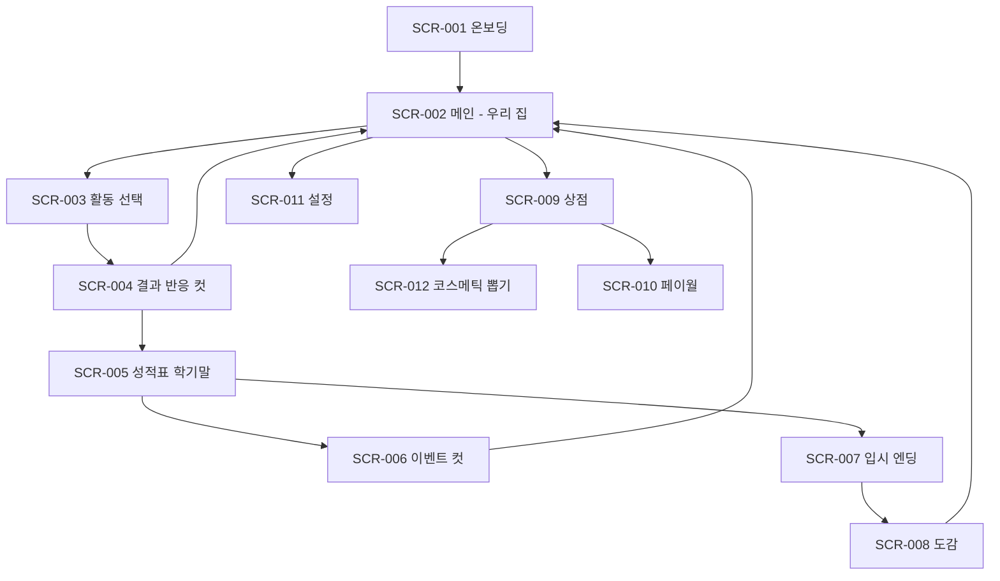

# UI UX 명세

- 제품명: 내 새끼 대학 보내기 (app-id: keeum)
- 문서 상태: approved
- 버전/수정일: v1 / 2026-07-25
- Source of truth: 화면 계약·상태·피드백·접근성. 저해상도 와이어프레임 원본은 Obsidian 기획서 11장
- Open blockers: 없음 (대표 화면 high-fidelity art target은 Vertical Slice 전 별도 승인 게이트)
- 승인 근거: 사용자 최종 승인 "승인 + 승격 진행" / 2026-07-25

## 내비게이션 그래프

## 디자인 시스템

- 컬러 토큰(다크모드 대응): 베이스 크림 `#FBF3E7`, 브랜드·정서 코럴 `#F28C79`, 자연 세이지 `#A7C4A0`, 학습 소프트블루 `#7FA9D9`, 스트레스 앰버 `#E8B54D`, 유대감 웜핑크 `#F4B8C1`, 텍스트 웜다크브라운 `#4A4038`(순흑 금지). 의미색만 기능색, 나머지 파스텔·무채.
- 타이포: 한국어 우선 둥근 고딕 계열(라이선스 확인 후 확정), 큰 본문·명확한 위계.
- 터치 영역: Android 48dp 이상, Apple 게임 컨트롤 지침 최신본 준수. 하단 엄지 도달권에 주 행동 배치.
- 세로 고정. 과한 게이미피케이션·자극색·카운트다운 도박 연출 금지(힐링 하드게이트).

## 화면 계약

원칙: 메인 플레이 화면은 자녀와 우리 집이 주인공. 숫자 카드·관리 패널이 지배하는 대시보드 구성 금지. 스탯은 얇은 상단 바.

| ID | 화면 | 목적 | 주 행동 | 보조 행동 | 분석 이벤트 |
| --- | --- | --- | --- | --- | --- |
| SCR-001 | 온보딩·아이 만들기 | 세계관 진입, 애착 형성 | 성별(아들/딸/중성)·이름·첫인상 선택 | 건너뛰기 없음(5분 설계) | `raise_run_start` |
| SCR-002 | 메인(우리 집) | 자녀 반응·현황, 단일 CTA | "이번 달 활동 정하기" | 도감·상점·설정 진입 | `raise_home_view` |
| SCR-003 | 활동 선택 | 슬롯 2개 배분(학습 축·여가 축) | 활동 카드 선택 | 지난 달 유지, 보상형 보너스 슬롯 | `raise_activity_pick` |
| SCR-004 | 결과 반응 컷 | 인과·보상 피드백 | 다음 | 보상 2배(보상형) | `raise_activity_result` |
| SCR-005 | 성적표·학기말 | 학기 정산·분기 | 다음 학기 | 상세 스탯 열람 | `raise_term_end` |
| SCR-006 | 이벤트 컷 | 서사·선택(사춘기·유혹·전환기) | 선택지 | 보상형 부스트(전환기 한정) | `raise_event_choice` |
| SCR-007 | 입시·엔딩 | 결말 연출·회고 | 도감 등록 | 결과 공유, 다음 아이 | `raise_ending`, `raise_share` |
| SCR-008 | 도감 | 수집 동기·회차 훅 | 회차 시작 | 엔딩 상세 열람 | `raise_codex_view` |
| SCR-009 | 상점 | 수익화 허브 | 구매 | 구매 복원·약관 | `raise_store_view`, `raise_purchase` |
| SCR-010 | 페이월 | 광고제거·시즌패스 전환 | 구매 | 닫기 | `raise_paywall_view` |
| SCR-011 | 설정 | 계정·알림·접근성 | 저장 | 계정 삭제·데이터 초기화 | 없음 |
| SCR-012 | 코스메틱 뽑기 | 가챠(확률·천장 공개) | 단차·10연 뽑기 | 확률 상세, 교환소, 마일리지 | `raise_gacha_view`, `raise_gacha_pull` |

- SCR-012 필수 요소: 구매 직전 화면에 등급별 확률 백분율·천장(40회 확정) 상시 표시, 유상·무상 통합 확률, 마일리지 교환소 진입. 압박형 연출 금지.

## 상태 매트릭스

- 공통: `default / pressed / disabled / loading / error / offline / success`.
- 활동 카드: + `locked`(단계 미해금, 해금 조건 노출), `selected`.
- 상점·가챠·페이월: + `purchase pending / purchased / restored`, 네트워크 오류 시 재시도와 복원 안내.
- 도감: + `empty`(첫 회차 전 안내), 미수집 실루엣.
- 오프라인: 핵심 플레이 전 화면 동작, 상점·가챠·클라우드 동기화만 온라인 요구 상태 표시.

## 피드백과 게임 필

- 핵심 행동(활동 선택)마다 5단 피드백: 입력 상태(카드 눌림) → 즉시 반응(아이 표정·대사) → 인과(델타 팝업·경고 넛지) → 결과(게이지 애니) → 보상(파티클·스팅어·햅틱).
- 숫자만 바뀌는 피드백은 실패로 간주한다. 스트레스 경고는 앰버 펄스 + 시무룩 표정 + 짧은 저음(절제).
- 감정 비트(가족 컷·전환기·엔딩)에는 광고·상점 노출 금지.

## 접근성

- 동적 폰트 크기(시스템 설정 연동), 최소 대비 준수(웜다크브라운 텍스트 기준), 색약 대응(의미색에 아이콘 병행).
- TTS 지원(이벤트 텍스트 낭독), 햅틱 강도 설정, 모션 감소 옵션(파티클·바운스 축소).
- 터치 48dp 보장, 한 손(엄지) 조작 완결.

## 반응형 기기 매트릭스

- 세로 고정. 비율 검증 3종: 최소 16:9(구형), 대표 19.5:9(주력 폰), 최대 21:9 및 태블릿 레터박스.
- Safe area: 노치·펀치홀·홈 인디케이터 회피를 상단 정보바·하단 CTA 모두에 적용. 실제 기기에서 잘림·가독성·엄지 도달성·프레임 페이싱 검증(브라우저 창 크기 검증으로 대체 금지).

## 첫 세션 스토리보드

| 시간 | 화면·연출 | 행동 | 가르치는 것 | 감정 |
| --- | --- | --- | --- | --- |
| 0:00~0:15 | 따뜻한 타이틀·피아노. "오늘부터, 당신은 이 아이의 부모입니다" | 탭 시작 | 없음 | 기대·따뜻함 |
| 0:15~0:50 | 유아 등장, 아이 만들기 | 성별+이름+첫인상 1택 | 아이는 나의 것 | 애착(유대감 씨앗) |
| 0:50~1:40 | 메인, 활동 2~3개만(학원 잠금) | 활동 1택(손가락 유도) | 루프: 입력→반응→인과→보상 | "내 선택이 통한다" |
| 1:40~2:30 | 가족 컷, 유대감 게이지 첫 등장 | 탭 | 유대감 소개 | 애착 정점 |
| 2:30~3:30 | 성장 연출, "초등 입학! 학원 해금" | 학원 대 놀이 선택 | 트레이드오프 | "성적만이 답 아니구나" |
| 3:30~4:20 | 활동 중 아이가 반짝이는 순간 | 보기 | 적성 디스커버리 | 발견의 설렘 |
| 4:20~5:00 | 목표 카드 + 다음 마일스톤 | 알림 옵트인·첫 보상 | 대학 목표(부드럽게) | "어떻게 키울지는 당신에게" |

유혹·가챠·전환기·대형 여가·원서는 첫 5분에 노출하지 않는다.

## UI 인수 증거

- 대량 구현 전: 대표 플레이 화면(SCR-002) high-fidelity art target 1장 + component state sheet 승인(04 문서 승인 게이트와 연동).
- 구현 후: 실기기 3종(저·중·고사양)에서 annotated screenshot으로 시선 우선순위·safe area·상태·피드백 판정. 각 SCR별 상태 매트릭스 캡처를 QA 증거로 보관(07 문서).
- 온보딩은 첫 세션 실플레이 영상으로 5분 KPI 달성을 증명한다.
