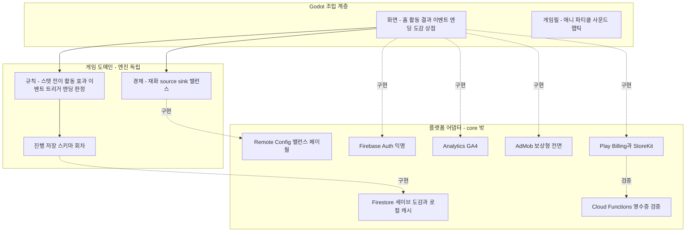

# 기술 제작 계획

- 제품명: 내 새끼 대학 보내기 (app-id: keeum)
- 문서 상태: approved
- 버전/수정일: v1 / 2026-07-25
- Source of truth: 아키텍처·데이터·분석·플랫폼 연동·제작 단계. 스택 검증 근거는 2026-07-24 조사
- Open blockers: 없음 (착수 초기 실기 스파이크 3건은 Core Gate 진입 조건)
- 승인 근거: 사용자 최종 승인 "승인 + 승격 진행" / 2026-07-25

## 아키텍처와 엔진

- 엔진: Godot (내부 CI 표준 4.6.3-stable, 스파이크 결과에 따라 4.7.x 채택 검토). 2026-07-24 조사로 확정 가능 판정 완료 — 전 구성요소가 현행 버전 호환, 내부 Seorilabs repo(lucid-chess, lizard-tycoon, spiritgate-defenders, foam-party)에서 개별 실증.
- Clean Architecture 경계:

- core는 Godot·Firebase·광고·결제 SDK를 직접 import하지 않는다. 밸런스 상수·활동·이벤트·엔딩은 데이터 리소스로 분리한다.

## 데이터 계약

| 엔티티 | 필드(요지) |
| --- | --- |
| Child | id, name, gender(아들/딸/중성 — 외형·인칭 전용, 결과 영향 없음), appearance 파츠 프리셋, 기질, 적성 5축, 체질, 멘탈, 나이·단계, 과목별 성적, 체력·정서·특기, 스트레스, seed |
| Activity | id, 이름, 기관, 방법, 활동군, 단계 요건, 효과 델타, 재력 비용, 스트레스 델타, 소요 턴 |
| Household | 재력, 프리미엄 통화, 유대감, 해금 상태, 세대(회차) |
| TransitionEvent | 게이트, 목표 성향, 성공 확률 입력(유대감·정합·정서), 광고 부스트 사용 여부, 결과 |
| EventCard | id, 트리거 조건(나이·스탯·스트레스), 선택지 목록, 결과 |
| TemptationState | 유혹별 사용 횟수, 의존 게이지, 적발 리스크 |
| Ending | id, 조건식, 대학·직업, 도감 분류, 회고 텍스트 |
| RunRecord | 회차별 최종 스탯·엔딩·소요 턴, 도감 상태 |
| Entitlement | 광고제거·시즌패스 권한, 영수증 검증 상태 |

- 저장 스키마에 `schema_version` 필드. 성별은 스탯·이벤트·엔딩 로직에서 참조 금지(정적 검사로 강제).

## 분석 이벤트 분류

- GA4 권장 게임 이벤트 우선 재사용(level_start/level_end 매핑) + `raise_*` 커스텀.

| 이벤트 | 시점 | 핵심 파라미터 | 전환 |
| --- | --- | --- | --- |
| raise_run_start | 아이 생성 완료 | seed, traits | 예 |
| raise_activity_pick | 활동 선택 | activity_id, stage, stress | 아니오 |
| raise_term_end | 학기 정산 | stage, avg_stats, stress | 예(리텐션) |
| raise_event_choice | 이벤트 선택 | event_id, choice | 아니오 |
| raise_ending | 엔딩 도달 | ending_id, turns, happiness | 예(핵심) |
| raise_rewarded_view | 보상형 시청 | placement | 아니오 |
| raise_paywall_view | 페이월 노출 | trigger | 아니오 |
| raise_purchase | 구매 | product, price | 예(핵심) |
| raise_gacha_pull | 가챠 실행 | pull_count, pity_count, paid_or_free | 아니오 |
| raise_share / raise_codex_view | 공유·도감 | ending_id / collected_count | 아니오 |

- 퍼널: 온보딩 → 첫 활동 → 첫 학기 완료 → 첫 엔딩 → 회차 2 → 광고제거 전환. 리텐션 D1/D7/D30, ARPDAU, 보상형 시청률, 페이월 전환.
- Analytics 자동 수집(first_open, session_start)은 네이티브 SDK 경유만 가능하므로 Measurement Protocol 단독 설계를 금지한다(플랫폼 연동 참조).

## 성능 예산

- 대표 기기 60fps, 저사양 안정 30fps 이상. 프레임 페이싱 히치 없는 카드·파티클 연출.
- Cold start 3초 이내(대표 기기), 메모리 상한 저사양 기준 설정, 발열로 인한 스로틀 시 파티클 자동 감소.
- 저사양·중간·고사양 실기기에서 FPS·발열·메모리·cold start·중단 복귀·네트워크 단절을 측정한다(07 문서).

## 저장 마이그레이션

- 로컬 우선 저장(Godot user 경로, 턴마다 자동) + Firestore 백업·동기화. 익명 계정에서 정식 연결 병합 경로 설계.
- schema_version 증가 시 마이그레이션 함수와 deterministic test를 함께 커밋한다. 구버전 세이브 픽스처를 저장소에 보관해 회귀 검증.
- 회차·도감 데이터 손실 0 목표. 클라우드 충돌은 최신 턴 우선 + 사용자 확인 폴백.

## 백엔드와 보안 경계

- Firebase: Auth(익명), Firestore(세이브·도감), Remote Config(밸런스·페이월), Analytics(GA4), Crashlytics, Cloud Functions(영수증 검증).
- 서버 권위: IAP 영수증 검증은 Cloud Functions + 스토어 서버 API(내부 lizard-tycoon 패턴 재사용). service account·secret은 클라이언트에 넣지 않는다.
- 가챠 추첨은 클라이언트 시드 기반이되 표기 확률과 로직 일치를 로그·테스트로 증명 가능하게 설계한다(확률 오표시 소송특례 대응).

## 플랫폼 연동

2026-07-24 검증 결과(01 문서 SRC-013 이후 참조):

| 기능 | 채택 경로 | 근거 |
| --- | --- | --- |
| AdMob 보상형 | Poing godot-admob-plugin v5 계열 | v5.0.0(2026-07-21) Godot 4.2+, 양 OS. 내부 spiritgate-defenders 사용 중 |
| Play Billing | godot-sdk-integrations v3.2.0 = Billing Library 8.3.0 | 2026-08-31 v8 이상 요건 충족. 내부 lizard-tycoon 동일 버전 운용 |
| iOS StoreKit | 내부 lizard-tycoon StoreKit2 fork 재사용 | 공식 계열 v0.2는 불안정 명시. fork가 서버 검증까지 내부 실증 |
| Firebase 데이터 | GodotNuts REST(Auth 익명·Firestore·Remote Config) | v6.0.6 활성. 내부 minimax-defense REST 게이트웨이 선례 |
| Analytics·Crashlytics | 네이티브 플러그인(Godotx Firebase 3.x 또는 lucid-chess 자체 플러그인 패턴) | REST로 불가. 내부 lucid-chess 실증 |
| 마켓 요건 | Android target API 36(2026-08-31), Apple Xcode 26 + iOS 26 SDK(2026-04-28 발효) | 공식 공지 확인 |

Core Gate 진입 조건 — 실기 스파이크 3건(1회성):

1. iOS 빈 프로젝트: AdMob v5 보상형 + firebase-ios-sdk 12.16(Remote Config 링크 포함) → Xcode 26 archive → TestFlight 업로드 + 강제 crash 리포트 수신 확인.
2. lizard-tycoon StoreKit2 fork를 대상 Godot 버전으로 재빌드 후 sandbox 구매 1건.
3. Android target API 36 AAB + Billing 8.3.0 테스트 구매 + 보상형 노출 + Crashlytics 리포트 수신.

알려진 리스크: Remote Config iOS 네이티브 링크 실패 실측(iOS 15 floor + firebase-ios-sdk 12.x로 재시도), Poing v4에서 v5 마이그레이션 비용(신규는 v5 시작으로 회피), AppsInToss는 phase 2에서 Godot Web 성능·광고·결제 지원 범위 확인.

## 제작 단계

| 게이트 | 산출물 | 종료 기준 |
| --- | --- | --- |
| Discovery | 본 설계 팩 + 승인 | 완료(2026-07-25 승인) |
| Core | 실기 스파이크 3건 + 저장·로드 + 활동→스탯→학기 최소 루프 | 한 학기 플레이 가능 + deterministic 공식 테스트 통과 |
| Vertical Slice | 첫 세션이 최종 목표 근접 UI·아트·사운드·game feel로 동작 | 대표 플레이 화면·anchor 승인, 온보딩 5분 실플레이 |
| Production | 전 단계·활동·이벤트·엔딩·경제·분석·광고·IAP·가챠 | 콘텐츠 재고 완성, 확률 공개 UI 구현 |
| Hardening | 마이그레이션·성능·발열·접근성·오류 복구·실기기 QA | 실기기 3종 통과 |
| Release | 서명 빌드·마켓 메타·정책·SDK·telemetry·소프트론칭 준비 | 출시 게이트 통과(07 문서) |
| Evidence | 소프트론칭 지표로 가설 판정 | 확대 결정 |

- 상용 출시가 목표이므로 버티컬 슬라이스·로컬 빌드로 완료 처리하지 않는다. Release·Evidence Gate와 실제 마켓·기기 증거가 종료 조건.

## 빌드와 테스트 명령

- Godot headless import·export를 CI 게이트로: 로그에서 `SCRIPT ERROR`, `ERROR:`, 누락 리소스를 파싱해 실패 처리(seorilabs-godot-quality-gates 표준).
- GDScript strict typing 강제. PR마다 Godot compile-only 게이트 필수 통과.
- CI 러너: lint·경량 검증은 seorilabs-rpi-arm64. Android AAB release는 x64 Linux, Apple archive는 macOS 러너(RPI ARM64로 보내지 않는다).
- 경제 공식·저장 마이그레이션·가챠 확률은 GUT 또는 동급 프레임워크의 deterministic test로 상시 회귀 검증. 설계 팩 구조는 validate_design_pack.py --strict로 검증한다.
